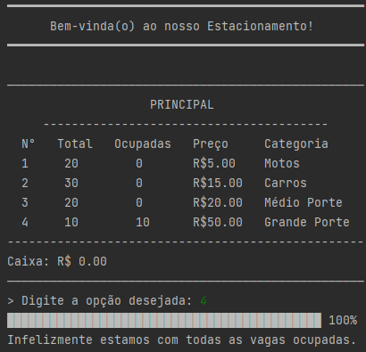
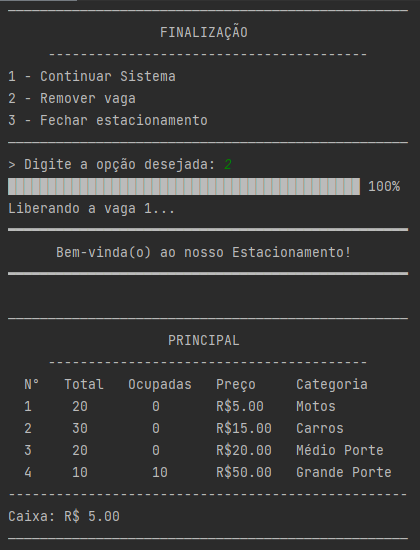

# Desafio Estacionamento - Exemplos de um possível processamento:

<table align="center">
  <thead>
    <tr>
      <th colspan="2">Quando existem vagas disponíveis</th>
    </tr>
  </thead>
  <tbody>
    <tr align="center">
      <td>Cadastrando um veículo</td>
      <td>Realizando o pagamento</td>
    </tr>
    <tr align="center">
      <td></td>
      <td></td>
    </tr>
    <tr align="center">
      <td>Fechando o Estacionamento</td>
      <td>Erros</td>
    </tr>
    <tr align="center">
      <td></td>
      <td></td>
    </tr align="center">
  </tbody>
</table>

<table align="center">
  <thead>
    <tr>
      <th colspan="2">Outras ações</th>
    </tr>
  </thead>
  <tbody>
    <tr align="center">
      <td>Tentando cadastrar um veículo</td>
      <td>Cancelando pagamento</td>
    </tr>
    <tr align="center">
      <td></td>
      <td></td>
    </tr>
  </tbody>
</table>

<table align="center">
  <thead>
    <tr>
      <th colspan="2">Quando não existem vagas disponíveis:</th>
    </tr>
  </thead>
  <tbody>
    <tr align="center">
      <td>Escolhendo outra opção</td>
      <td>Removendo vaga atual</td>
    </tr>
    <tr align="center">
      <td></td>
      <td></td>
    </tr>
  </tbody>
</table>
