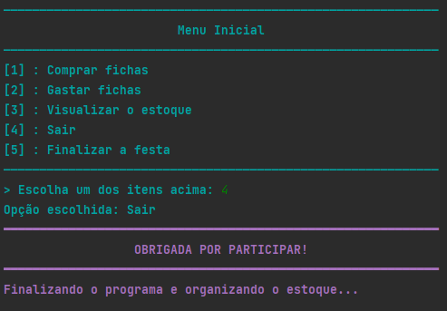

# Desafio: Festa da Escola

> Importante: Caso queira utilizar o programa, baixe a pasta por completo. Nela haverá tanto o arquivo principal e a pasta de imagens, como os pacotes criados para a execução.

## Exemplos de uma possível execução:

  <h3>Primeira ação (normal e com erro)</h3>
  <figure>
    
   </figure>
  
  <figure>
     
   </figure>

  <h3>Segunda ação (duas possibilidades e erro)</h3>
  <figure>
    
  </figure>
  
  <figure>
    
  </figure>
  
  <figure>
     
   </figure>

  <h3>Erro na escolha do item e Terceira ação</h3>
  <figure>
    
  </figure>
  
  <figure>
    
  </figure>

  <h3>Opções de Finalização</h3>
  
  <figure>
    
  </figure>
  
  <figure>
    
  </figure>

